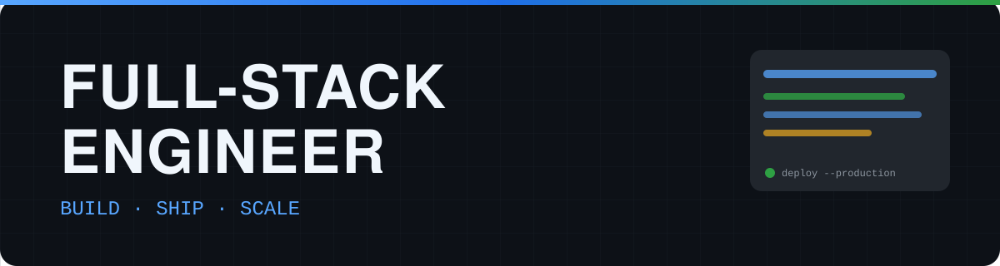

# Hi, I'm Nguyen Trung Truc 👋

Full-Stack Web Developer building scalable web applications and developer-focused products.

**Focus:** Laravel · PHP · Next.js · Vue.js · React · Node.js  
**Location:** Vietnam

## About Me

I am a passionate IT professional with extensive experience in software development, system architecture, and emerging technologies. With a strong foundation in programming languages/technologies, example: Php, Vue.js, React, I specialize in building scalable and efficient solutions that solve real-world problems.

I thrive in dynamic environments, enjoy collaborating with cross-functional teams, and have a proven track record of delivering projects on time and exceeding expectations. My expertise spans full-stack development, enabling me to bridge the gap between business requirements and technical execution.

Always eager to learn and adapt, I am committed to continuous improvement, exploring new technologies, and contributing to innovative IT projects that drive growth and transformation.

## Tech Stack

### Frontend
- Next.js
- React
- Vue.js
- TypeScript
- JavaScript
- Tailwind CSS

### Backend
- Laravel
- PHP
- Node.js
- Spring Boot

### Database
- MySQL
- PostgreSQL
- MongoDB
- SQL Server

### DevOps / Cloud
- Docker
- GitHub Actions
- Vercel

## Featured Projects

### MyResume — Personal Portfolio CMS

A personal portfolio with a built-in admin CMS. I update profile, projects, skills, and SEO from the dashboard — no redeploy required.

**Stack:**
- Next.js 16 (App Router) and React 19
- Tailwind CSS 4
- Prisma 7 with a PostgreSQL driver adapter
- Supabase PostgreSQL (runtime pooler + direct URL for migrations)
- Auth.js v5 — Google OAuth and a rotatable access-token login
- Supabase Storage for images and CV files
  
**Architecture:**
- Public routes: Home, About, Experience, Projects, Project detail, Contact.
- Admin modules: Profile, Projects, Experience, Education, Skills, Blog, Gallery, Settings.
- Core models include User and Profile, Project (linked to Skill), Experience, Education, Post (with tags and SEO fields), Media, Contact messages, and SiteSettings. Most records support soft delete so unique slugs stay intact after a delete.
- Public reads go through cached server data helpers. Writes go through Server Actions that require an admin session.
[Repository](https://gitlab.com/react-v-nextjs/myresume) · [Live Demo](https://nttdev.cloud/)

### Machine Operation Management Website – SGC (Steel Company)

Developed an enterprise Machine Operation Management System for a steel manufacturing company to automate machine operation and packaging workflows. Implemented secure authentication, authorization, and RBAC with .NET REST APIs. Built employee and machine management modules with dynamic parameter configuration and automated SQL Server data retrieval. Applied Vue Router and Pinia for scalable routing and centralized state management, while optimizing API and remote database communication for stable enterprise deployment.

**Stack:**
- Vue.js
- SQL Server
- .NET
  
**Architecture:**
Public routes: Home, About, Experience, Projects, Project detail, Contact.
Admin modules: Profile, Projects, Experience, Education, Skills, Blog, Gallery, Settings.
Core models include User and Profile, Project (linked to Skill), Experience, Education, Post (with tags and SEO fields), Media, Contact messages, and SiteSettings. Most records support soft delete so unique slugs stay intact after a delete.
Public reads go through cached server data helpers. Writes go through Server Actions that require an admin session.
[Repository](https://gitlab.com/react-v-nextjs/myresume) · [Live Demo](https://nttdev.cloud/)

### Matchix – Sports Booking & Community Platform

Contributed to a microservices-based sports booking and player-matching platform. Developed Booking Service and integrated APIs across web and mobile systems. Built React Native application architecture and implemented Home and Team features. Delivered responsive UI and dynamic data integration for web and mobile platforms.

**Stack:** Java Spring Boot · Next.js 16 (App Router) and React 19 · PostgreSQL · React Native 

**Architecture:** 
- Integrated frontend components with backend services by implementing API consumption and data rendering for booking, team, and related functionalities.
- Built the React Native application architecture, including project structure, navigation flow, reusable components, and core setup.
- Developed the Home screen on the mobile application with dynamic content integration.
- Implemented the Team Matching feature on the mobile application, enabling users to create and discover team recruitment posts.
  
[Repository](https://gitlab.com/trungtruc59/matchix-app) · [Live Demo](https://matchix.cloud/)

## Engineering Focus

- Scalable backend architecture
- API design
- Database optimization
- Web performance
- SEO
- Authentication & authorization
- Cloud deployment
- CI/CD
- Microservices
- Developer tooling

## Current Focus

- Building high-performance full-stack products
- Improving CI/CD pipelines and delivery reliability
- Expanding architecture skills for distributed systems

## Currently Learning

- Advanced system design for modern web platforms
- Performance profiling and optimization patterns
- Security-first engineering practices for web applications

## Connect

- GitHub: [github.com/trungtruc59](https://github.com/trungtruc59)
- LinkedIn: [Nguyễn Trung Trực](https://www.linkedin.com/in/brian-nguyen-dev5920/)
- Portfolio: [Nguyễn Trung Trực](https://nttdev.cloud/)
- Email: [Nguyễn Trung Trực](mailto:trungtruc.dev@gmail.com)

