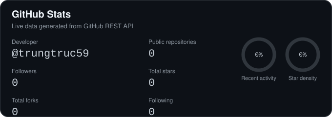
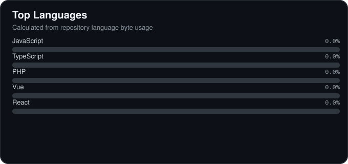
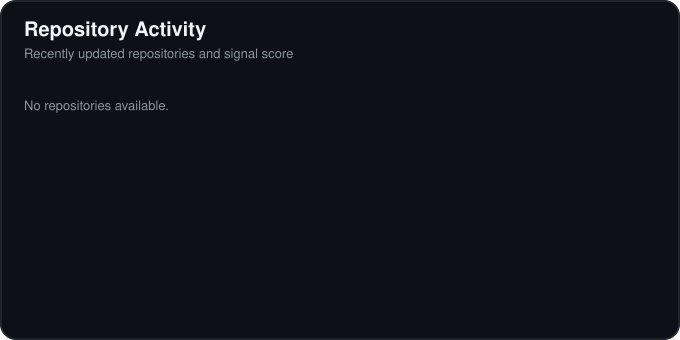
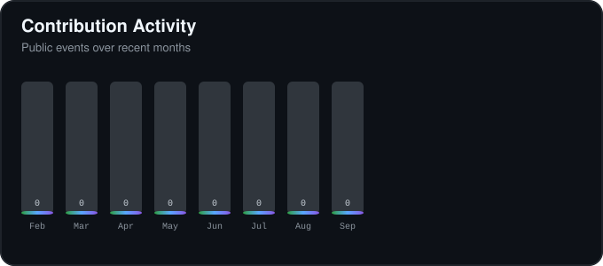
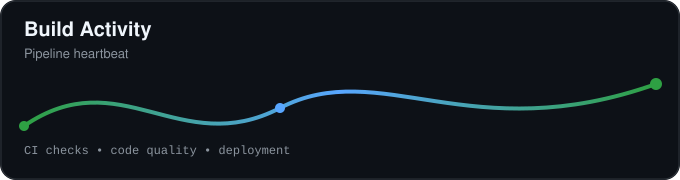
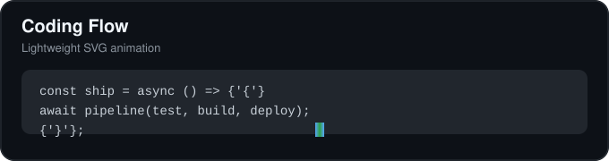

# Hi, I'm Nguyen Trung Truc 👋


Full-Stack Web Developer building scalable web applications and developer-focused products.

**Focus:** Laravel · PHP · Next.js · Vue.js · React · Node.js  
**Location:** YOUR_LOCATION

[](https://github.com/trungtruc59)
[](https://www.linkedin.com/in/brian-nguyen-dev5920/)
[](https://nttdev.cloud/)
[](https://github.com/YOUR_GITHUB_USERNAME)

## About Me

I design and deliver production-grade web systems with a strong focus on performance, maintainability, and developer experience. I enjoy shipping practical products that combine clean architecture with measurable business impact.

## Tech Stack

### Frontend
- Next.js
- React
- Vue.js
- TypeScript
- JavaScript
- Tailwind CSS

### Backend
- Laravel
- PHP
- Node.js
- Spring Boot

### Database
- MySQL
- PostgreSQL
- MongoDB
- SQL Server

### DevOps / Cloud
- Docker
- GitHub Actions
- Vercel
- Linux

## GitHub Metrics









## Contribution Activity



## Featured Projects

### PROJECT_NAME_1

Short description of what this project solves and why it matters.

**Stack:** Next.js · TypeScript · PostgreSQL · Docker  
**Architecture:** Modular services, cache-first reads, background job processing  
[Repository](https://github.com/YOUR_GITHUB_USERNAME/PROJECT_REPO_1) · [Live Demo](YOUR_PROJECT_DEMO_1)

### PROJECT_NAME_2

Short description focused on product value and engineering challenge.

**Stack:** Laravel · PHP · MySQL · Redis  
**Architecture:** Clean domain boundaries, queue-based workflows, resilient API integration  
[Repository](https://github.com/YOUR_GITHUB_USERNAME/PROJECT_REPO_2) · [Live Demo](YOUR_PROJECT_DEMO_2)

### PROJECT_NAME_3

Short description focused on scale, performance, or developer tooling.

**Stack:** React · Node.js · MongoDB · GitHub Actions  
**Architecture:** CI-driven delivery, observability-first design, horizontal scalability  
[Repository](https://github.com/YOUR_GITHUB_USERNAME/PROJECT_REPO_3) · [Live Demo](YOUR_PROJECT_DEMO_3)

## Engineering Focus

- Scalable backend architecture
- API design
- Database optimization
- Web performance
- SEO
- Authentication & authorization
- Cloud deployment
- CI/CD
- Microservices
- Developer tooling

## Current Focus

- Building high-performance full-stack products
- Improving CI/CD pipelines and delivery reliability
- Expanding architecture skills for distributed systems

## Currently Learning

- Advanced system design for modern web platforms
- Performance profiling and optimization patterns
- Security-first engineering practices for web applications

## Development Philosophy

Build with clarity, ship with discipline, and optimize with real data.

## Developer Animation




> `terminal.gif` is a lightweight placeholder. Replace it with your own optimized terminal animation (copyright-safe) when ready.

## Connect

- GitHub: [github.com/YOUR_GITHUB_USERNAME](https://github.com/YOUR_GITHUB_USERNAME)
- LinkedIn: [YOUR_LINKEDIN](YOUR_LINKEDIN)
- Portfolio: [YOUR_PORTFOLIO](YOUR_PORTFOLIO)
- Email: [YOUR_EMAIL](mailto:YOUR_EMAIL)

---

## Automation & Customization

### How it works

- `npm run profile` generates visual assets in `assets/banners` and `assets/animations`.
- `npm run metrics` fetches GitHub data using the REST API and generates SVG cards in `assets/metrics`.
- `.github/workflows/update-readme.yml` runs on schedule and manual dispatch, then commits refreshed assets.

### Required GitHub configuration

1. Set repository variable `GITHUB_USERNAME` to your GitHub username.
2. Ensure Actions are enabled; workflow uses built-in `GITHUB_TOKEN` with `contents: write`.

### Local commands

```bash
npm install
npm run profile
GITHUB_USERNAME=YOUR_GITHUB_USERNAME npm run metrics
```

### Customization points

- Update profile links/placeholders directly in `README.md`.
- Adjust colors and animation behavior in `scripts/utils/svg.js` and `scripts/render-profile.js`.
- Tune metrics card layout in `scripts/render-metrics.js`.
- Replace `assets/animations/terminal.gif` with your own optimized GIF.
